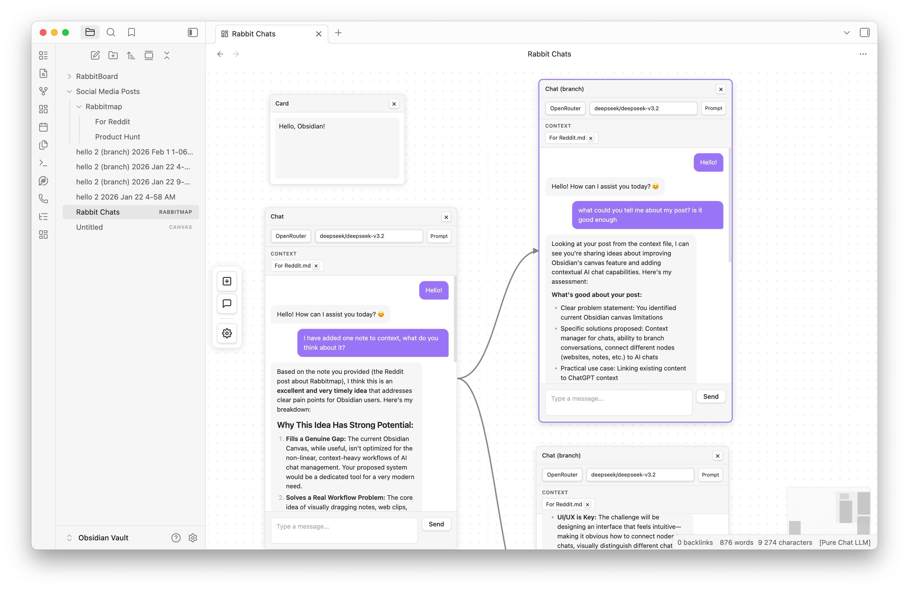

# RabbitMap

An infinite canvas plugin for Obsidian with AI chat nodes. Create visual workspaces where you can have multiple LLM conversations alongside your notes — with easy drag & drop context management from your vault.

## Features

- **Infinite Canvas** — Pan and zoom with trackpad, mouse wheel, or space+drag
- **Chat Nodes** — Have AI conversations directly on the canvas
- **Card Nodes** — Create text notes and organize your thoughts
- **Context from Vault** — Drag & drop files or folders onto chat nodes to add them as context
- **Multiple Providers** — Support for OpenAI and OpenRouter APIs
- **Custom Models** — Configure your own list of models for OpenRouter
- **Multi-select** — Select multiple nodes with drag box, move them together
- **Minimap** — Navigate large canvases easily
- **Branch Conversations** — Right-click on any message to branch or fork the chat
- **Export** — Export chat history to markdown

## Installation

### From Obsidian Community Plugins

1. Open Obsidian Settings
2. Go to Community Plugins and disable Safe Mode
3. Click Browse and search for "RabbitMap"
4. Install and enable the plugin

### Manual Installation

1. Download `main.js`, `manifest.json`, and `styles.css` from the latest release
2. Create a folder `rabbitmap` in your vault's `.obsidian/plugins/` directory
3. Copy the downloaded files into the folder
4. Reload Obsidian and enable the plugin

## Usage

1. Click the RabbitMap icon in the ribbon or use the command palette to create a new canvas
2. Use the toolbar on the left to add Chat or Card nodes
3. Open Settings (gear icon) to configure your API keys
4. Start chatting!

### Adding Context to Chats

Drag files or folders from the Obsidian file explorer directly onto a chat node. The files will be added as context and sent with your messages.

### Keyboard Shortcuts

- **Space + Drag** — Pan the canvas
- **Scroll** — Zoom in/out
- **Double-click header** — Zoom to node
- **Click + Drag** — Select multiple nodes

## Configuration

Open the settings modal (gear icon in toolbar) to configure:

- **OpenAI API Key** — For GPT models
- **OpenRouter API Key** — For access to Claude, Gemini, and other models
- **Custom Models** — Add your preferred OpenRouter models

## File Format

RabbitMap files use the `.rabbitmap` extension and store data in JSON format.

## Community

This plugin is part of [rabbitmap.com](https://rabbitmap.com) — a cloud research OS for saving and organizing web content on canvas.

- Follow [@bayradion](https://x.com/bayradion) on X
- Join our [Discord](https://discord.gg/UeUBkmxEcV)

## License

MIT License
